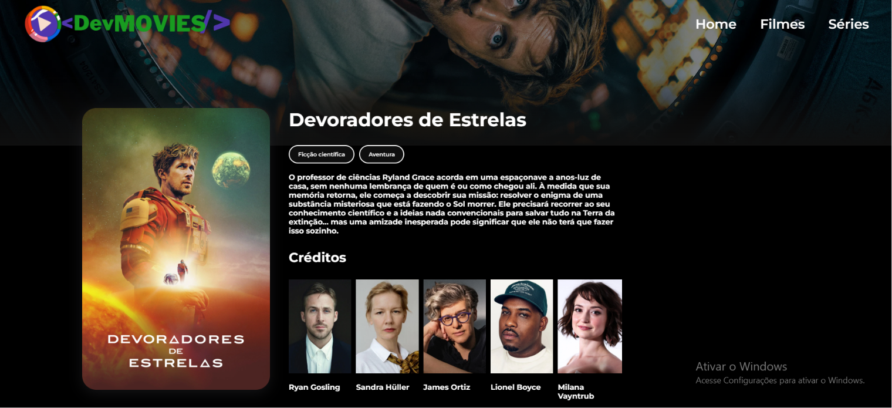
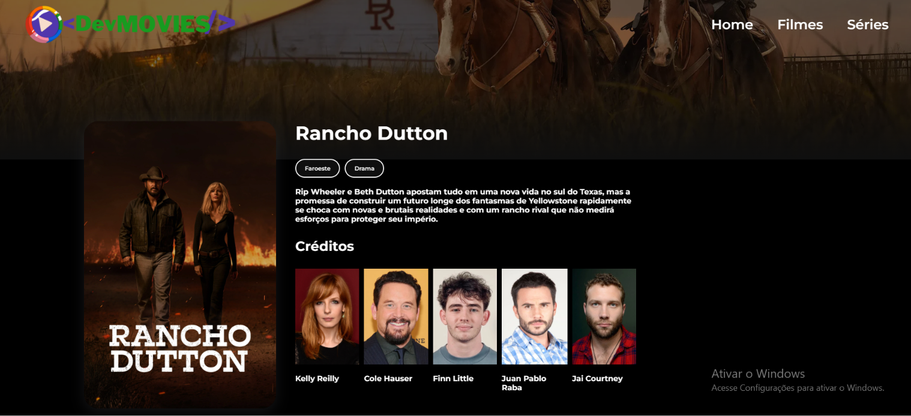

# 🎬 DevMovie — Filmes e Séries com React

Aplicação web para explorar filmes e séries usando a API do TMDB (The Movie Database). Desenvolvida para praticar React na prática, com roteamento dinâmico, consumo de API e componentização.

---

## 📸 Preview

> **Home**


> **Detalhes do Filme**


> **Detalhes da Série**


---

## ✨ Funcionalidades

- 🏠 **Home** com banner do filme em destaque e sliders por categoria
- 🎥 **Filmes** — top filmes, filmes populares, por gênero (ação, comédia, sci-fi, terror)
- 📺 **Séries** — top séries, séries populares, por gênero
- 🔍 **Página de detalhes** para filmes e séries com:
  - Informações gerais (título, sinopse, gêneros)
  - Créditos do elenco
  - Vídeos e trailers do YouTube
  - Conteúdo similar
- 🎭 **Top artistas** em destaque

---

## 🛠 Tecnologias

| Tecnologia | Uso |
|------------|-----|
| [React](https://react.dev/) | Interface e componentização |
| [React Router DOM](https://reactrouter.com/) | Roteamento entre páginas |
| [Styled Components](https://styled-components.com/) | Estilização dos componentes |
| [Axios](https://axios-http.com/) | Requisições HTTP |
| [Swiper](https://swiperjs.com/) | Sliders de cards |
| [TMDB API](https://developer.themoviedb.org/) | Dados de filmes e séries |

---

## 🚀 Como rodar o projeto

### Pré-requisitos

- Node.js instalado
- Conta na [TMDB](https://www.themoviedb.org/) para obter a chave da API

### Passo a passo

```bash
# Clone o repositório
git clone https://github.com/ErianVT/dev-movies.git

# Entre na pasta
cd dev-movies

# Instale as dependências
npm install
```

Crie um arquivo `.env` na raiz do projeto com sua chave da API:

```env
VITE_API_KEY=sua_chave_aqui
VITE_API_BASE_URL=https://api.themoviedb.org/3
```

```bash
# Rode o projeto
npm run dev
```

Acesse em `http://localhost:5173`

---

## 📚 O que aprendi desenvolvendo esse projeto

Esse projeto foi um grande laboratório de aprendizado. Abaixo estão os principais desafios que encontrei e como os resolvi:

### 🔀 Roteamento dinâmico por tipo de conteúdo

O TMDB tem endpoints separados para filmes (`/movie/{id}`) e séries (`/tv/{id}`). O mesmo número de ID pode existir nos dois, mas representar conteúdos completamente diferentes.

A solução foi criar **rotas separadas** e detectar o tipo pelo próprio caminho da URL:

```javascript
// Router.jsx
<Route path="/detalhe/filme/:id" element={<Detail />} />
<Route path="/detalhe/serie/:id" element={<Detail />} />

// Detail.jsx
const isSeries = location.pathname.includes('/serie/')
```

### 🧠 Identificar o tipo de item no Card

Séries sempre retornam o campo `first_air_date`, filmes retornam `release_date`. Usei isso para decidir para qual rota navegar ao clicar em um card:

```javascript
const isSeries = Boolean(item.first_air_date)
navigate(isSeries ? `/detalhe/serie/${item.id}` : `/detalhe/filme/${item.id}`)
```

### 🛡 Dados assíncronos e renderização defensiva

Aprendi que componentes renderizam **antes** dos dados da API chegarem. Chamar `.filter()` ou `.map()` em `undefined` derruba a página inteira. A solução foi sempre verificar antes de usar:

```javascript
if (!credits || !Array.isArray(credits)) return null
```

### 🔍 Ler a resposta da API com cuidado

O endpoint `/credits` retorna `cast`, não `results`. Misturar esses campos faz a função retornar `undefined` silenciosamente — sem erro, sem dado. Aprendi a sempre conferir a estrutura real da resposta antes de desestruturar.

---

## 🗂 Estrutura do projeto

```
src/
├── components/       # Componentes reutilizáveis (Card, Slider, Credits, Modal...)
├── containers/       # Páginas (Home, Movies, Series, Detail)
├── services/         # Chamadas à API do TMDB (getData.js)
├── layout/           # Layout padrão com header/footer
├── utils/            # Funções auxiliares (getImages)
└── routes/           # Definição das rotas
```

---

## 👨‍💻 Autor

Feito por **Erian Tomé** — em transição de carreira para desenvolvimento, estudando na prática.

[](https://www.linkedin.com/in/erian-tome/)
[](https://www.instagram.com/erian.tome/)

---

> *"Rotina, código e propósito."*
